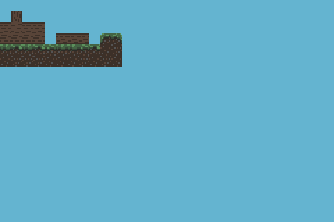

# gba-background-test


**Note: unless a proper header is added, this program will not work on real hardware (nor some emulators).**
I do not include the header in order to avoid copyright infringement, as it includes a bitmap of the Nintendo logo.

Assemble with the [Goldroad 1.7](https://www.gbadev.org/tools.php?showinfo=192) assembler:
```sh
goldroad.exe background.asm
```
